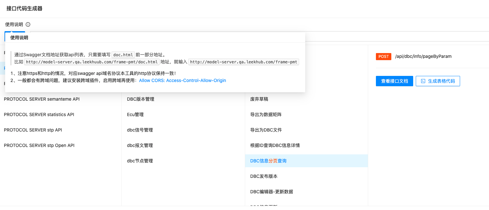
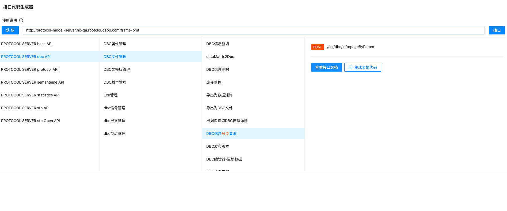
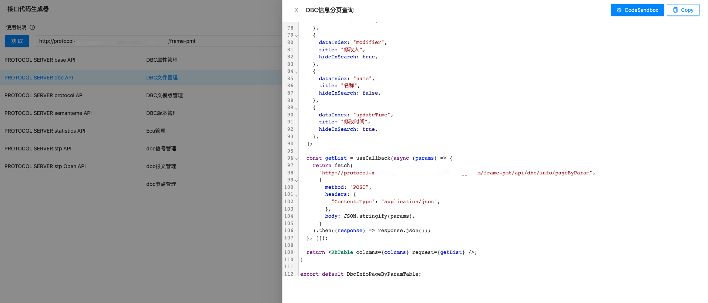
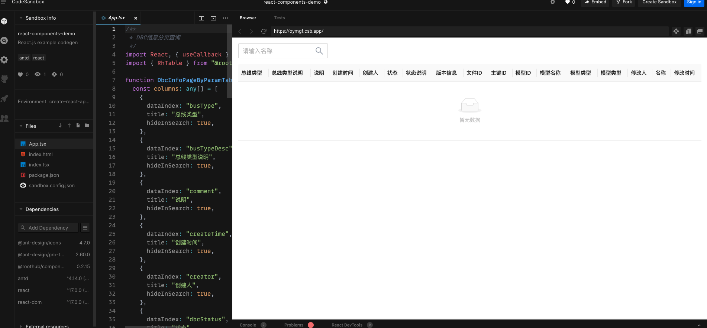

# roothub-codegen

http://codegen.leekhub.com/codegen/

## TODO List

- 枚举代码生成
- 考虑结合 https://github.com/alibaba/formily 
- 参考antd pro 模板的api，或者工程[ts-codegen](https://github.com/reeli/ts-codegen)改进
  - 改进方式：rh api init 配置文件`rhapi-codegen.config.json`，后续更新接口代码都不需要手动重复的执行 `rh api 「url」`

## Screenshots

### 分页列表页代码生成

1、分页接口会高亮字体提示

2、分页接口可以预览生成的列表页面代码

3、支持codesandbox 打开预览效果

