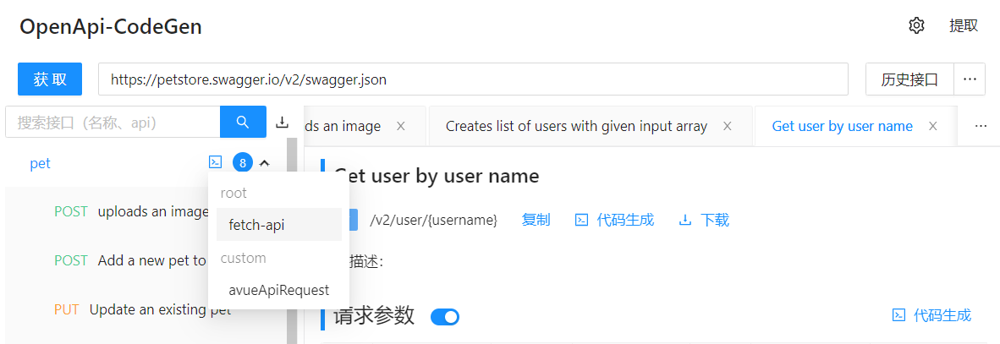
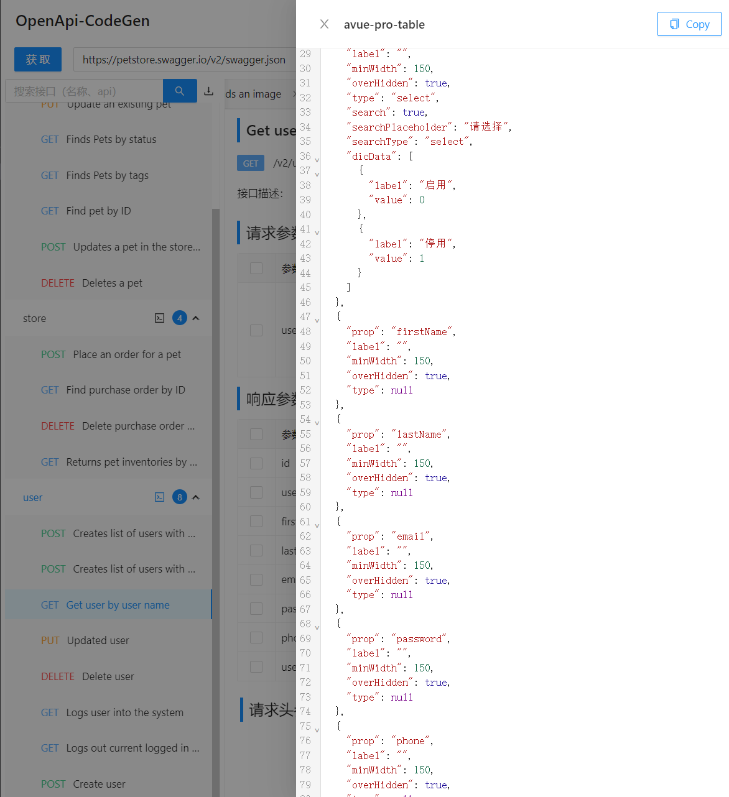

<!--
 * @Author: ZtrainWilliams ztrain1224@163.com
 * @Date: 2022-06-14 17:11:39
 * @Description: 
-->
# roothub-codegen

安装 [RootHub VSCode](https://marketplace.visualstudio.com/items?itemName=giscafer.roothub) 插件，使用 CodeGen 生成代码
## 开发说明文档

### 页面开发说明

本项目基于 Umi3.x，本地开发和 Umi开发没区别
### RootHub VSCode插件开发说明

在 vscode-roothub 工程下，git submodule update 代码后，cd 进入 codegen 工程

然后 `yarn start` 启动项目（端口默认 3031）

`.vscode/launch.json`，运行 `vscode extension` 时添加启动环境变量 ，打开 CodeGen 会自动获取 http://localhost:3031 的地址内容。

```json
{
  "version": "0.2.0",
  "configurations": [
    {
      "name": "Run Extension",
      "type": "extensionHost",
      "request": "launch",
      "args": ["--extensionDevelopmentPath=${workspaceFolder}"],
      "outFiles": ["${workspaceFolder}/dist/**/*.js"],
      "preLaunchTask": "${defaultBuildTask}",
      // 启动环境变量
      "env": {
        "NODE_ENV": "development"
      }
    },
    {
      "name": "Extension Tests",
      "type": "extensionHost",
      "request": "launch",
      "args": [
        "--extensionDevelopmentPath=${workspaceFolder}",
        "--extensionTestsPath=${workspaceFolder}/out/test/suite/index"
      ],
      "outFiles": [
        "${workspaceFolder}/out/**/*.js",
        "${workspaceFolder}/dist/**/*.js"
      ],
      "preLaunchTask": "tasks: watch-tests"
    }
  ]
}
```

## Screenshots



### 分页列表页代码生成

1、类swagger-ui2.0模式查看接口文档，支持当前菜单搜索


2、分页接口可以预览生成的列表页面代码



3、支持 codesandbox 打开预览效果


4、自定义代码生成方法-在线编辑


